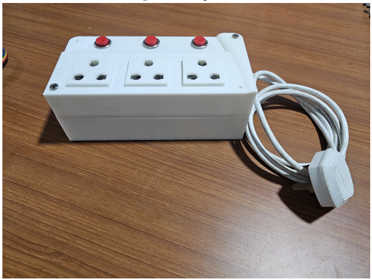
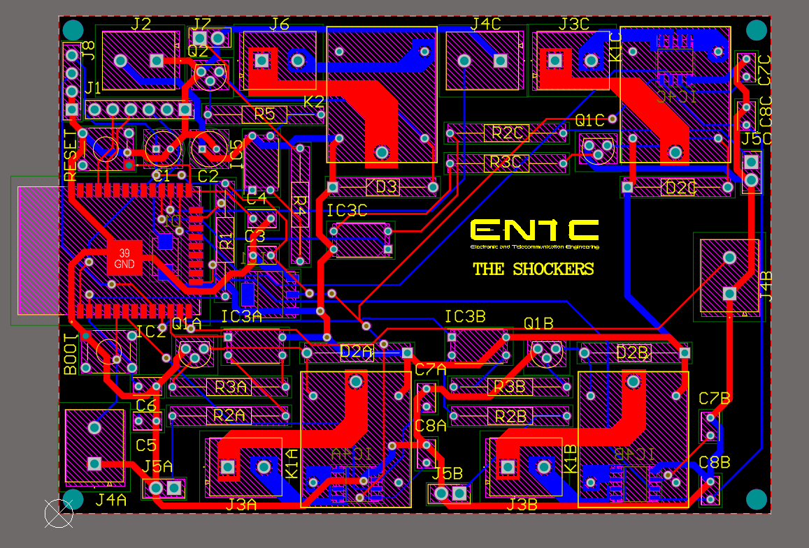
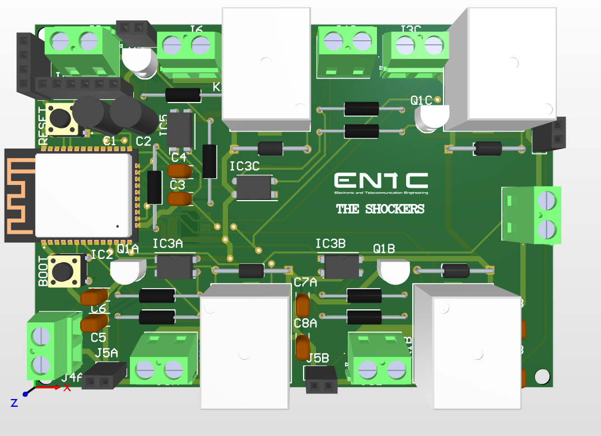

# Smart Extension Cord Project 💡🔌

**Project Report**  
Department of Electronic & Telecommunication Engineering,  
University of Moratuwa, Sri Lanka.  
EN1190 Engineering Design Project - August 2024

## 🚀 Project Overview

The Smart Extension Cord is an innovative solution designed to address the challenges of energy management in households. Traditional power strips lack visibility into individual device power consumption and remote control capabilities, leading to energy wastage and inconvenience. This project introduces a smart extension cord that enables power consumption monitoring and remote control of multiple outlets via a smartphone app, promoting efficient energy usage and user convenience.

## 🌟 Key Features

- ✅ **Remote On/Off Functionality**: Control individual outlets remotely via a smartphone app.
- 📊 **Power Consumption Monitoring**: Real-time tracking of energy usage for each connected device.
- 🔗 **Multiple Outlets**: Manage up to four devices simultaneously.
- 🤳 **Smartphone App Control**: Intuitive mobile application developed using MIT App Inventor for seamless monitoring and control.
- 🔥 **Safety and Durability**: Fire-resistant enclosure designed for safety and aesthetics.

## 📋 My Contributions

As a key contributor to the Smart Extension Cord project, my focus was on the following areas:

1. **MCU Coding**:
   - Developed the firmware for the ESP32-WROOM-32 microcontroller to handle:
     - Real-time power consumption calculations using ACS712 current sensors and ZMPT101B voltage sensor.
     - Relay control for switching outlets on/off.
     - Wi-Fi connectivity for communication with the Firebase Realtime Database.
     - Real-time data streaming and synchronization with the mobile app.
   - Implemented a web server for initial Wi-Fi configuration, allowing users to input network credentials via a captive portal.
   - Managed data storage and retrieval using Firebase, ensuring hourly power consumption data is logged and accessible.

2. **Mobile App Development**:
   - Designed and developed a user-friendly mobile application using **MIT App Inventor**.
   - Features include:
     - Real-time power consumption display for each outlet.
     - Remote on/off control for individual outlets.
     - Historical power usage visualization.
   - Exported the app as an `Shockers.apk` file for Android devices and provided the `Appinventor/Shockers.aia` project file for further modifications.

3. **Firebase Realtime Database**:
   - Set up and configured the **Firebase Realtime Database** to store:
     - Power consumption data for each outlet, organized by hour and day.
     - Switch states for remote control.
     - Date and time tracking for data aggregation.
   - Structured the database (see `firebase/firebase_database.json`) to ensure efficient data retrieval and updates.
   - Integrated the database with the ESP32 firmware and mobile app for seamless data flow.

4. **Hardware-Software Integration**:
   - Connected the ESP32-based hardware with the mobile app via Firebase, enabling real-time communication.
   - Ensured robust synchronization between physical switch toggles, app controls, and Firebase updates.
   - Tested and debugged the system to ensure reliable operation under various conditions.

## 🛠️ Technology Stack

### Hardware
- **ESP32-WROOM-32 Microcontroller**: Core processing unit for control and communication.
- **ACS712 Current Sensors**: For accurate current measurement.
- **ZMPT101B Voltage Sensor**: For voltage monitoring.
- **5V Relays**: For controlling power to individual outlets.
- **5V Power Supply**: To power the system.

### Software
- **MCU Firmware**: Written in C++ using the Arduino framework (see `MCUCode/FEDP.ino`).
- **Mobile App**: Developed using **MIT App Inventor** (see `Appinventor/Shockers.aia` and `apk/Shockers.apk`).
- **Firebase Realtime Database**: For data storage and real-time updates (see `firebase/firebase_database.json`).
- **PCB Design**: Designed using Altium Designer for compact and reliable electronics.
- **Enclosure Design**: Created using SolidWorks for 3D printing.

## 🖼️ Visuals

### Mobile App Interfaces

  

  Figure 1: Mobile App Interface - Initial page

  

  Figure 2: Mobile App Interface - Outlet Control

  <table>
    <tr>
      <td align="center">
        
         
        <em>Figure 3: Daily Consumption View</em>
      </td>
      <td align="center">
        
         
        <em>Figure 4: Weekly Trend Analysis</em>
      </td>
    </tr>
  </table>

### Final Product with Enclosure

  

  Figure 5: Final View of the Assembled Smart Extension Cord

### PCB Design

  

  Figure 6: 2D PCB Layout

  

  Figure 7: 3D Rendered PCB Layout

## 📂 Files

- `FEDP.ino`: ESP32 firmware for controlling the smart extension cord.
- `Shockers.aia`: MIT App Inventor project file for the mobile app.
- `Shockers.apk`: Compiled Android app for end-users.
- `firebase_database.json`: Structure of the Firebase Realtime Database.

## 🚀 Getting Started

1. **Hardware Setup**:
   - Assemble the hardware as per the schematics and PCB layout.
   - Flash the `FEDP.ino` firmware onto the ESP32 using the Arduino IDE.

2. **Wi-Fi Configuration**:
   - Connect to the ESP32's access point (`ESP32`, password: `12345678`).
   - Access the web interface at `192.168.4.1` to input Wi-Fi credentials.

3. **Mobile App Installation**:
   - Install `Shockers.apk` on an Android device.
   - Alternatively, import `Shockers.aia` into MIT App Inventor for customization.

4. **Firebase Setup**:
   - Configure Firebase Realtime Database with the provided `firebase_database.json` structure.
   - Update the Firebase credentials in `FEDP.ino` (`FIREBASE_HOST` and `FIREBASE_AUTH`).

5. **Usage**:
   - Use the mobile app to monitor power consumption and control outlets.
   - Physical buttons or the app can toggle outlets, with states synced via Firebase.

## 🙌 Acknowledgments

  

  Figure 8: My Team

This project was a collaborative effort by the team at the University of Moratuwa. Special thanks to my teammates for their contributions to hardware design, PCB layout, and enclosure design, which complemented my work on the MCU, mobile app, and database integration.

---

This README provides a comprehensive overview of my contributions to the Smart Extension Cord project, highlighting the technical implementation and key deliverables.
